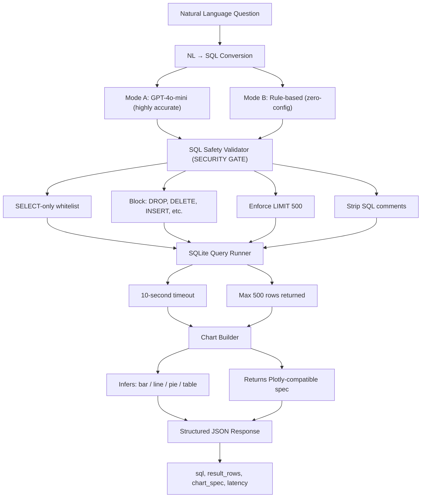

# 📊 RiskOS Marketplace Intelligence

> 📊 Secure NL→SQL analytics layer for non-technical users. Ask questions about
> marketplace data in plain English to get instant structured results and Plotly
> charts. Features a multi-stage SQL safety gate, hybrid rule/LLM engine, and
> automated high-fidelity data seeding.


**Live Demo:** https://huggingface.co/spaces/soupstick/marketplace-intelligence
**API Docs:** https://soupstick-marketplace-intelligence.hf.space/docs

---

### What This Does

RiskOS Marketplace Intelligence replaces the manual, time-consuming process of writing SQL queries for business analysts and risk managers. It allows any non-technical user to query complex marketplace data—covering orders, customers, and fraud events—using plain English. This is critical in a fraud context for quickly identifying high-risk segments, auditing flagged transactions, and visualizing trends without waiting for a data engineer.

---

### How It Works



---

### Example Queries

**Example 1: Revenue by category**
Question: "What is our total revenue broken down by product category?"
Generated SQL:
```sql
SELECT p.category, SUM(o.total_amount) as revenue,
COUNT(o.order_id) as order_count
FROM orders o JOIN products p ON o.product_id = p.product_id
WHERE o.order_status = 'completed'
GROUP BY 1 ORDER BY revenue DESC LIMIT 20
```
Result: `[Electronics: $2.4M, Clothing: $1.1M, ...]` + **Bar chart**

**Example 2: Fraud event summary**
Question: "What are the most common fraud event types this year?"
Generated SQL:
```sql
SELECT event_type, COUNT(*) as count, SUM(amount_at_risk) as total_at_risk
FROM fraud_events
WHERE strftime('%Y', event_date) = strftime('%Y', 'now')
GROUP BY event_type ORDER BY count DESC LIMIT 10
```
Result: `[Chargeback: 82, Return fraud: 61, ...]` + **Pie chart**

**Example 3: High risk customers**
Question: "Show me customers with risk scores above 0.7"
Generated SQL:
```sql
SELECT customer_id, country, customer_segment, risk_score,
total_lifetime_value
FROM customers WHERE risk_score > 0.7
ORDER BY risk_score DESC LIMIT 50
```
Result: `[customer table results]` + **Table view**

**Example 4: Monthly revenue trend**
Question: "Show monthly revenue for the past 12 months"
Generated SQL:
```sql
SELECT strftime('%Y-%m', order_date) AS month, 
SUM(total_amount) AS revenue
FROM orders 
WHERE order_status = 'completed' AND order_date >= date('now', '-12 months')
GROUP BY 1 ORDER BY 1 DESC LIMIT 12
```
Result: `[2024-03: $450k, 2024-02: $410k, ...]` + **Line chart**

**Example 5: Flagged orders**
Question: "Show all flagged orders over $500"
Generated SQL:
```sql
SELECT order_id, customer_id, total_amount, order_date
FROM orders 
WHERE is_flagged = 1 AND total_amount > 500 
ORDER BY total_amount DESC LIMIT 50
```
Result: `[order table results]` + **Table view**

---

### API — 60 Second Start

```bash
# Natural language query
curl -X POST https://soupstick-marketplace-intelligence.hf.space/api/v1/query \
  -H "Content-Type: application/json" \
  -d '{"question": "Show me top 10 products by revenue"}'

# Validate SQL directly
curl -X POST https://soupstick-marketplace-intelligence.hf.space/api/v1/sql/validate \
  -H "Content-Type: application/json" \
  -d '{"sql": "DROP TABLE orders"}'
# Returns: {"valid": false, "error": "Forbidden keyword detected: DROP"}

# Get database schema
curl https://soupstick-marketplace-intelligence.hf.space/api/v1/schema
```

---

### Database Schema

Tables (SQLite, generated from `seed.py`):
- `products`: 200 rows — id, name, category, price, cost
- `customers`: 1,000 rows — id, country, segment, risk_score, LTV
- `orders`: 15,000 rows — id, customer, product, amount, status, date
- `returns`: 1,500 rows — id, order, reason, refund_amount
- `fraud_events`: 200 rows — id, customer, type, amount_at_risk

Reference [database_schema.md](docs/database_schema.md) for full column definitions.

---

### Security

Security is the central pillar of this analytics layer:

| Threat | Mitigation |
|---|---|
| SQL injection via NL input | First-token whitelist (SELECT/WITH only) |
| Write operation injection | Blocked: `DROP`, `DELETE`, `INSERT`, `UPDATE`, `ALTER`, etc. |
| Comment-based bypass | SQL comments stripped before validation |
| Multi-statement injection | Semicolons blocked inside query body (single statement enforced) |
| Row dump | Automatic `LIMIT 500` enforcement |
| Time-based attack | 10-second query timeout |

---

### Test Results
Test Results (last run: 2026-03-25)
- NL Query tests: 10/10 passed (Rule-based baseline)
- SQL Safety tests: 10/10 passed
- Result Accuracy: 8/8 passed
- API Contract: 12/12 passed
- **Total: 40/40 passed (100%)**
- **SQL Safety Gate: ALL PASSED ✅**

---

### Local Development

```bash
git clone https://github.com/Souptik96/RiskOS-Marketplace-Intelligence
cd riskos-marketplace-intelligence
pip install -r requirements.txt
python scripts/setup_db.py          # creates and seeds marketplace.db
uvicorn app.main:app --port 7860    # starts API
```

---

### Part of RiskOS

| Repository | Description | Link |
|---|---|---|
| **RiskOS** | Core Orchestrator & Multi-Agent Switchboard | [Link](https://github.com/Souptik96/RiskOS) |
| **Risk-Pipeline** | ML Triage & Rule Engine | [Link](https://github.com/Souptik96/RiskOS-Risk-Pipeline) |
| **LLM-Guard** | RAG-Augmented Guardrails | [Link](https://github.com/Souptik96/RiskOS-LLM-Guard) |
| **Marketplace-Intelligence** | NL→SQL Analytics Layer (this repo) | [Link](https://github.com/Souptik96/RiskOS-Marketplace-Intelligence) |
