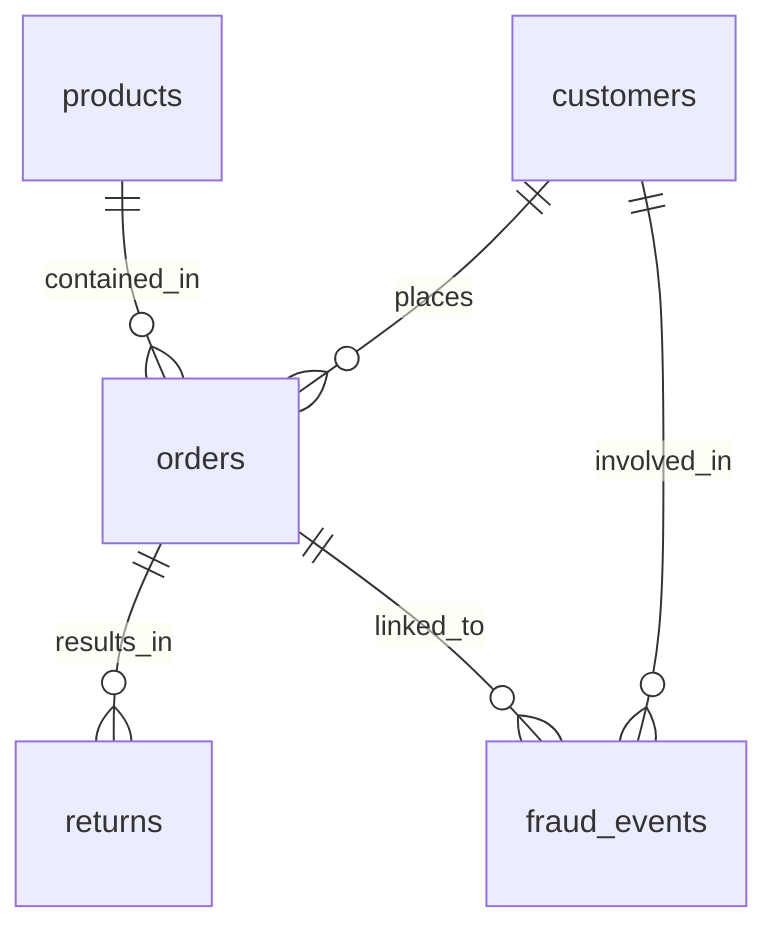

# Database Schema Documentation

The RiskOS Marketplace Intelligence system uses an embedded SQLite database (`marketplace.db`) to store transaction, product, and customer data.

## 1. Entity-Relationship Overview

## 2. Table Definitions

### `products`
Stores information about the marketplace inventory.
- `product_id` (TEXT, PK): Unique identifier (e.g., P0001).
- `name` (TEXT): Full product name.
- `category` (TEXT): High-level category (Electronics, Clothing, etc.).
- `subcategory` (TEXT): Specific type (Laptop, Sneakers).
- `brand` (TEXT): Manufacturer brand.
- `unit_price` (REAL): Selling price in USD.
- `cost_price` (REAL): Procurement cost in USD.
- `stock_quantity` (INTEGER): Current inventory levels.
- `supplier_country` (TEXT): Origin of the product.

### `customers`
Stores profile and risk metadata for users.
- `customer_id` (TEXT, PK): Unique identifier (e.g., C0001).
- `country` (TEXT): Customer residency.
- `region` (TEXT): Geographical region (North America, Europe, etc.).
- `customer_segment` (TEXT): retail, wholesale, or enterprise.
- `account_age_days` (INTEGER): Days since account creation.
- `total_lifetime_value` (REAL): Aggregated historical spend.
- `risk_score` (REAL): Probability of fraud (0.0 to 1.0).

### `orders`
The central transaction log.
- `order_id` (TEXT, PK): Unique identifier.
- `customer_id` (TEXT, FK): Reference to `customers`.
- `product_id` (TEXT, FK): Reference to `products`.
- `quantity` (INTEGER): Units purchased.
- `total_amount` (REAL): Final transaction value.
- `order_status` (TEXT): completed, returned, cancelled, or pending.
- `payment_method` (TEXT): card, bank_transfer, crypto, or cash.
- `is_flagged` (INTEGER): Binary flag for suspicious activity (0 or 1).
- `order_date` (TEXT): Timestamp in 'YYYY-MM-DD HH:MM:SS' format.

### `returns`
Logs for returned items and refunds.
- `return_id` (TEXT, PK): Unique identifier.
- `order_id` (TEXT, FK): Reference to `orders`.
- `reason` (TEXT): defective, wrong_item, changed_mind, etc.
- `refund_amount` (REAL): Amount returned to the customer.

### `fraud_events`
Audit trail for confirmed or suspected fraud.
- `event_id` (TEXT, PK): Unique identifier.
- `event_type` (TEXT): chargeback, return_fraud, identity_theft, etc.
- `amount_at_risk` (REAL): Potential or actual loss value.
- `resolved` (INTEGER): Closure status (0 or 1).

## 3. Data Integrity
- **Stateless Seeding**: Use `python scripts/setup_db.py` to recreate the database from scratch.
- **Foreign Keys**: Enforced via SQLite `PRAGMA foreign_keys = ON`.
- **Dates**: Stored as ISO-8601 strings for compatibility with SQLite `strftime`.
